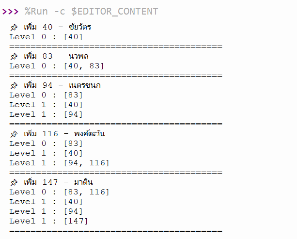
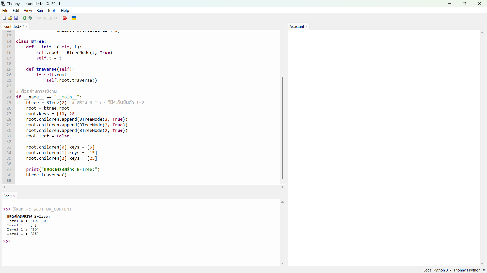
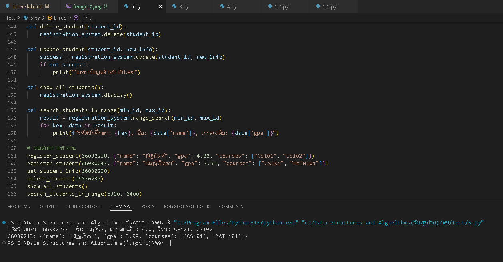

# ใบงานการทดลอง: B-Tree

## วัตถุประสงค์
1. เพื่อให้นักศึกษาเข้าใจโครงสร้างและหลักการทำงานของ B-Tree
2. เพื่อให้นักศึกษาสามารถสร้างและจัดการ B-Tree ที่มี Order ต่างๆ ได้
3. เพื่อให้นักศึกษาสามารถประยุกต์ใช้ B-Tree ในการจัดเก็บและค้นหาข้อมูลได้
4. เพื่อให้นักศึกษาเข้าใจการทำงานของ splitting และ merging ใน B-Tree

## อุปกรณ์ที่ใช้
1. เครื่องคอมพิวเตอร์
2. โปรแกรม IDE หรือ Text Editor ที่รองรับการเขียนโปรแกรมภาษา Python
3. ใบงานการทดลอง

## ทฤษฎีที่เกี่ยวข้อง

### B-Tree คืออะไร
B-Tree เป็นโครงสร้างข้อมูลแบบต้นไม้ที่ถูกออกแบบมาเพื่อการจัดเก็บข้อมูลในหน่วยความจำสำรอง โดยสามารถเก็บข้อมูล (data) คู่กับค่าคีย์ (key) ในแต่ละโหนดได้ ทำให้สามารถค้นหาและเข้าถึงข้อมูลได้อย่างมีประสิทธิภาพ

### Order ใน B-Tree
Order (m) คือค่าที่กำหนดขนาดของโหนดใน B-Tree โดยมีผลต่อคุณสมบัติต่างๆ ดังนี้:

1. จำนวนคู่ key-data ในแต่ละโหนด:
   - จำนวนสูงสุด: m-1 คู่
   - จำนวนต่ำสุด: ⌈m/2⌉-1 คู่ (ยกเว้น root)
   
2. จำนวนลูกในแต่ละโหนด:
   - จำนวนลูกสูงสุด: m ลูก
   - จำนวนลูกต่ำสุด: ⌈m/2⌉ ลูก (ยกเว้น root)

ตัวอย่าง: B-Tree order 3
- แต่ละโหนดมี key ได้มากที่สุด 2 ตัว (3-1)
- แต่ละโหนดมี key ขั้นต่ำ 1 ตัว (⌈3/2⌉-1)
- แต่ละโหนดมีลูกได้มากที่สุด 3 โหนด
- แต่ละโหนดต้องมีลูกอย่างน้อย 2 โหนด (⌈3/2⌉)

### การจัดเก็บข้อมูลใน B-Tree
1. ลักษณะการเก็บข้อมูล:
   - B-Tree สามารถเก็บข้อมูล (data) ไว้กับ key ได้ในทุกโหนด
   - แต่ละ key จะมี data field ที่เก็บข้อมูลหรือ pointer ไปยังข้อมูลจริง
   - การค้นหาข้อมูลสามารถพบได้ตั้งแต่ root node

2. เปรียบเทียบกับ B+ Tree:
   
   B-Tree:
   - เก็บข้อมูลได้ในทุกโหนด
   - ค้นหาข้อมูลเจอได้เร็วกว่าถ้าข้อมูลอยู่ในโหนดบน
   - ใช้พื้นที่น้อยกว่าในการเก็บข้อมูล
   - เหมาะกับการค้นหาข้อมูลแบบ random access

   B+ Tree:
   - เก็บข้อมูลเฉพาะที่ leaf nodes
   - โหนดภายในเก็บเฉพาะ key สำหรับนำทาง
   - มี linked list เชื่อมระหว่าง leaf nodes
   - เหมาะกับการค้นหาแบบ range query

### ผลของ Order ต่อประสิทธิภาพ
1. Order น้อย (เช่น 3, 4):
   - ข้อดี: ใช้หน่วยความจำน้อย, การเพิ่ม/ลบข้อมูลทำได้เร็ว
   - ข้อเสีย: ต้นไม้อาจสูง, การค้นหาอาจช้า

2. Order มาก (เช่น 100, 200):
   - ข้อดี: ต้นไม้เตี้ย, การค้นหาเร็ว
   - ข้อเสีย: ใช้หน่วยความจำมาก, การเพิ่ม/ลบข้อมูลอาจช้า

### การนำ B-Tree ไปใช้งานจริง
1. ระบบจัดการฐานข้อมูล (Database Management Systems)
   - MySQL ใช้ B-Tree และ B+Tree ในการสร้าง Index
   - PostgreSQL ใช้ B-Tree สำหรับ Primary Key และ Index
   - Oracle Database ใช้ B-Tree ในการจัดการ Index

2. ระบบจัดการคลังสินค้า (Inventory Management Systems)
   - จัดการรหัสสินค้า (SKU) และตำแหน่งจัดเก็บ
   - ติดตามสต็อกสินค้าแบบ real-time
   - ระบบค้นหาสินค้าที่ใกล้หมดอายุ

3. ระบบทะเบียนนักศึกษา (Student Registration Systems)
   - จัดการรหัสนักศึกษาและประวัติการเรียน
   - ระบบลงทะเบียนเรียน
   - ระบบตรวจสอบผลการเรียน

4. ระบบไฟล์ (File Systems)
   - NTFS ของ Windows
   - HFS+ ของ Mac OS X
   - Ext4 ของ Linux

5. ระบบ DNS (Domain Name System)
   - จัดเก็บและค้นหา domain name
   - ระบบ cache สำหรับ DNS resolver

### คุณสมบัติทั่วไปของ B-Tree
- เป็น Self-balancing tree (ปรับสมดุลตัวเองอัตโนมัติ)
- ทุกใบ (leaf) อยู่ในระดับเดียวกัน
- จำนวนลูกของแต่ละโหนดจะมากกว่าจำนวน key เสมอ 1 ตัว
- ข้อมูลใน key จะเรียงจากน้อยไปมากจากซ้ายไปขวา
- ลูกทางซ้ายของ key จะมีค่าน้อยกว่า key
- ลูกทางขวาของ key จะมีค่ามากกว่า key
- สามารถเก็บข้อมูลได้ในทุกโหนด ไม่จำกัดเฉพาะ leaf nodes

## การทดลอง

### การทดลองที่ 1: การสร้าง B-Tree Node และ B-Tree

```python
class BTreeNode:
    def __init__(self, leaf=True):
        # leaf: บอกว่าโหนดนี้เป็นใบหรือไม่
        self.leaf = leaf
        # keys: เก็บค่า key ในโหนด เรียงจากน้อยไปมาก
        self.keys = []
        # data: เก็บข้อมูลที่สัมพันธ์กับแต่ละ key
        self.data = []
        # children: เก็บ pointer ไปยังลูกของโหนด
        self.children = []

class BTree:
    def __init__(self, order):
        # root: pointer ไปยังโหนด root
        self.root = None
        # order: กำหนดจำนวน key สูงสุดในแต่ละโหนด
        self.order = order
        
    def get_min_keys(self):
        # คำนวณจำนวน key ขั้นต่ำที่แต่ละโหนดต้องมี
        return (self.order // 2) - 1 if self.order % 2 == 0 else self.order // 2
        
    def get_max_keys(self):
        # คำนวณจำนวน key สูงสุดที่แต่ละโหนดสามารถมีได้
        return self.order - 1
```

### การทดลองที่ 2: การเพิ่มข้อมูลใน B-Tree

```python
def insert(self, key, data):
    # ถ้ายังไม่มี root
    if self.root is None:
        self.root = BTreeNode()
        self.root.keys.append(key)
        self.root.data.append(data)
        return
        
    # ถ้า root เต็ม
    if len(self.root.keys) == self.get_max_keys():
        new_root = BTreeNode(leaf=False)
        new_root.children.append(self.root)
        self._split_child(new_root, 0)
        self.root = new_root
        
    self._insert_non_full(self.root, key, data)

def _insert_non_full(self, node, key, data):
    i = len(node.keys) - 1
    
    if node.leaf:
        # หาตำแหน่งที่จะแทรก key และ data
        while i >= 0 and key < node.keys[i]:
            i -= 1
        i += 1
        node.keys.insert(i, key)
        node.data.insert(i, data)
    else:
        # หา child ที่เหมาะสม
        while i >= 0 and key < node.keys[i]:
            i -= 1
        i += 1
        
        if len(node.children[i].keys) == self.get_max_keys():
            self._split_child(node, i)
            if key > node.keys[i]:
                i += 1
                
        self._insert_non_full(node.children[i], key, data)

def _split_child(self, parent, i):
    order = self.order
    child = parent.children[i]
    
    # สร้างโหนดใหม่
    new_node = BTreeNode(child.leaf)
    
    # คำนวณตำแหน่งกลาง
    mid = order // 2
    
    # ย้าย keys และ data ไปยังโหนดใหม่
    new_node.keys = child.keys[mid:]
    new_node.data = child.data[mid:]
    
    # ตัด keys และ data ของโหนดเดิม
    child.keys = child.keys[:mid]
    child.data = child.data[:mid]
    
    # ถ้าไม่ใช่ใบ ต้องย้ายลูกด้วย
    if not child.leaf:
        new_node.children = child.children[mid:]
        child.children = child.children[:mid]
    
    # เพิ่ม key และ data ตรงกลางไปยัง parent
    parent.keys.insert(i, child.keys[mid])
    parent.data.insert(i, child.data[mid])
    parent.children.insert(i + 1, new_node)
```
### ผลการทดลองที่ 2
1. เขียนโปรแกรมเพื่อเพิ่มข้อมูลนักศึกษา 5 คน รันโปรแกรมและบันทึกรูปผลการรันโปรแกรม
```python
   class BTreeNode:
    def __init__(self, leaf=True):
        self.leaf = leaf  
        self.keys = []    
        self.data = []    
        self.children = []  


class BTree:
    def __init__(self, order):
        self.root = None
        self.order = order  
        
    def get_min_keys(self):
        return (self.order // 2) - 1 if self.order % 2 == 0 else self.order // 2

    def get_max_keys(self):
        return self.order - 1

    def insert(self, key, data):
        
        if self.root is None:
            self.root = BTreeNode()
            self.root.keys.append(key)
            self.root.data.append(data)
            return
        
        
        if len(self.root.keys) == self.get_max_keys():
            new_root = BTreeNode(leaf=False)
            new_root.children.append(self.root)
            self._split_child(new_root, 0)
            self.root = new_root
        
        self._insert_non_full(self.root, key, data)

    def _insert_non_full(self, node, key, data):
        i = len(node.keys) - 1
        
        if node.leaf:
            
            while i >= 0 and key < node.keys[i]:
                i -= 1
            i += 1
            node.keys.insert(i, key)
            node.data.insert(i, data)
        else:
            
            while i >= 0 and key < node.keys[i]:
                i -= 1
            i += 1

            
            if len(node.children[i].keys) == self.get_max_keys():
                self._split_child(node, i)
                if key > node.keys[i]:
                    i += 1

            
            self._insert_non_full(node.children[i], key, data)

    def _split_child(self, parent, i):
        child = parent.children[i]
        mid = len(child.keys) // 2  
        
        new_node = BTreeNode(child.leaf)
       
        new_node.keys = child.keys[mid + 1:]
        new_node.data = child.data[mid + 1:]

        child.keys = child.keys[:mid]
        child.data = child.data[:mid]

        if not child.leaf:
            new_node.children = child.children[mid + 1:]
            child.children = child.children[:mid + 1]

        if len(parent.keys) <= i:  
            parent.keys.append(child.keys[mid])  
            parent.data.append(child.data[mid])  
        else:
            parent.keys.insert(i, child.keys[mid])  
            parent.data.insert(i, child.data[mid])  

        parent.children.insert(i + 1, new_node)  

    def display(self, node=None, level=0):
        if node is None:
            node = self.root

        print(f"Level {level}: {node.keys}")

        if not node.leaf:
            for child in node.children:
                self.display(child, level + 1)


class BTreeNode:
    def __init__(self, leaf=True):
        self.leaf = leaf  
        self.keys = []    
        self.data = []    
        self.children = []  


class BTree:
    def __init__(self, order):
        self.root = None
        self.order = order  
        
    def get_min_keys(self):
        return (self.order // 2) - 1 if self.order % 2 == 0 else self.order // 2

    def get_max_keys(self):
        return self.order - 1

    def insert(self, key, data):
       
        if self.root is None:
            self.root = BTreeNode()
            self.root.keys.append(key)
            self.root.data.append(data)
            return
        
        if len(self.root.keys) == self.get_max_keys():
            new_root = BTreeNode(leaf=False)
            new_root.children.append(self.root)
            self._split_child(new_root, 0)
            self.root = new_root
        
        self._insert_non_full(self.root, key, data)

    def _insert_non_full(self, node, key, data):
        i = len(node.keys) - 1
        
        if node.leaf:
            while i >= 0 and key < node.keys[i]:
                i -= 1
            i += 1
            node.keys.insert(i, key)
            node.data.insert(i, data)
        else:
            
            while i >= 0 and key < node.keys[i]:
                i -= 1
            i += 1

            if len(node.children[i].keys) == self.get_max_keys():
                self._split_child(node, i)
                if key > node.keys[i]:
                    i += 1

           
            self._insert_non_full(node.children[i], key, data)

    def _split_child(self, parent, i):
        child = parent.children[i]
        mid = len(child.keys) // 2  
       
        new_node = BTreeNode(child.leaf)
        
        new_node.keys = child.keys[mid + 1:]
        new_node.data = child.data[mid + 1:]

        child.keys = child.keys[:mid]
        child.data = child.data[:mid]

        if not child.leaf:
            new_node.children = child.children[mid + 1:]
            child.children = child.children[:mid + 1]

        if len(parent.keys) <= i:  
            parent.keys.append(child.keys[mid])  
            parent.data.append(child.data[mid])  
        else:
            parent.keys.insert(i, child.keys[mid])  
            parent.data.insert(i, child.data[mid])  

        parent.children.insert(i + 1, new_node)  

    def display(self, node=None, level=0):
        if node is None:
            node = self.root

        print(f"Level {level}: {node.keys}")

        if not node.leaf:
            for child in node.children:
                self.display(child, level + 1)


btree = BTree(order=3)
```

2. แก้ไข class B-Tree ให้มีการเก็บจำนวน Entry สูงสุด และต่ำสุด แทนการใช้ get_min_keys และ get_max_keys
   ```python
   class BTreeNode:
    def __init__(self, leaf=True):
        self.leaf = leaf
        self.keys = []
        self.data = []
        self.children = []

    class BTree:
    def __init__(self, order):
        self.root = None
        self.order = order
        self.max_keys = order - 1 
        self.min_keys = (order // 2) - 1 if order % 2 == 0 else order // 2  
        
    def insert(self, key, data):
        if self.root is None:
            self.root = BTreeNode()
            self.root.keys.append(key)
            self.root.data.append(data)
            return
        if len(self.root.keys) == self.max_keys:
            new_root = BTreeNode(leaf=False)
            new_root.children.append(self.root)
            self._split_child(new_root, 0)
            self.root = new_root
        
        self._insert_non_full(self.root, key, data)

    def _insert_non_full(self, node, key, data):
        i = len(node.keys) - 1
        
        if node.leaf:
            while i >= 0 and key < node.keys[i]:
                i -= 1
            i += 1
            node.keys.insert(i, key)
            node.data.insert(i, data)
        else:
            while i >= 0 and key < node.keys[i]:
                i -= 1
            i += 1

            if len(node.children[i].keys) == self.max_keys:
                self._split_child(node, i)
                if key > node.keys[i]:
                    i += 1

            self._insert_non_full(node.children[i], key, data)

    def _split_child(self, parent, i):
        child = parent.children[i]
        mid = len(child.keys) // 2  

        new_node = BTreeNode(child.leaf)

        new_node.keys = child.keys[mid + 1:]
        new_node.data = child.data[mid + 1:]

        child.keys = child.keys[:mid]
        child.data = child.data[:mid]

        if not child.leaf:
            new_node.children = child.children[mid + 1:]
            child.children = child.children[:mid + 1]

        if len(parent.keys) <= i:  
            parent.keys.append(child.keys[mid])  
            parent.data.append(child.data[mid])  
        else:
            parent.keys.insert(i, child.keys[mid])  
            parent.data.insert(i, child.data[mid])  

        parent.children.insert(i + 1, new_node)  

    def display(self, node=None, level=0):
        if node is None:
            node = self.root

        print(f"Level {level}: {node.keys}")
    
        if not node.leaf:
            for child in node.children:
                self.display(child, level + 1)

    btree = BTree(order=3)
```


### การทดลองที่ 3: การค้นหาข้อมูลใน B-Tree

```python
def search(self, key):
    """ค้นหาข้อมูลจาก key ที่กำหนด"""
    def _search_node(node, key):
        i = 0
        # หาตำแหน่งที่เหมาะสม
        while i < len(node.keys) and key > node.keys[i]:
            i += 1
            
        # ถ้าเจอ key ที่ตรงกัน
        if i < len(node.keys) and key == node.keys[i]:
            return (node, i)
            
        # ถ้าเป็นใบและไม่เจอ key
        if node.leaf:
            return None
            
        # ค้นหาในลูกที่เหมาะสม
        return _search_node(node.children[i], key)
    
    if self.root is None:
        return None
        
    result = _search_node(self.root, key)
    if result:
        node, index = result
        return node.data[index]
    return None
```
### ผลการทดลอง
1. เขียนโปรแกรมเพื่อทดสอบการค้นหาข้อมูลใน B-Tree ตามข้อมูลที่ได้เพิ่มในการทดลองก่อนหน้า
   ```python
   class BTreeNode:
    def __init__(self, leaf=True):
        self.leaf = leaf
        self.keys = []
        self.data = []
        self.children = []

class BTree:
    def __init__(self, order):
        self.root = None
        self.order = order
        self.min_entries = (order + 1) // 2 - 1  # จำนวน key ขั้นต่ำ
        self.max_entries = order - 1             # จำนวน key สูงสุด

    def insert(self, key, data):
        if self.root is None:
            self.root = BTreeNode()
            self.root.keys.append(key)
            self.root.data.append(data)
            return

        if len(self.root.keys) == self.max_entries:
            new_root = BTreeNode(leaf=False)
            new_root.children.append(self.root)
            self._split_child(new_root, 0)
            self.root = new_root

        self._insert_non_full(self.root, key, data)

    def _insert_non_full(self, node, key, data):
        i = len(node.keys) - 1
        if node.leaf:
            while i >= 0 and key < node.keys[i]:
                i -= 1
            node.keys.insert(i + 1, key)
            node.data.insert(i + 1, data)
        else:
            while i >= 0 and key < node.keys[i]:
                i -= 1
            i += 1
            if len(node.children[i].keys) == self.max_entries:
                self._split_child(node, i)
                if key > node.keys[i]:
                    i += 1
            self._insert_non_full(node.children[i], key, data)

    def _split_child(self, parent, i):
        order = self.order
        child = parent.children[i]
        new_node = BTreeNode(child.leaf)
        mid = len(child.keys) // 2

        parent.keys.insert(i, child.keys[mid])
        parent.data.insert(i, child.data[mid])
        parent.children.insert(i + 1, new_node)

        new_node.keys = child.keys[mid + 1:]
        new_node.data = child.data[mid + 1:]
        child.keys = child.keys[:mid]
        child.data = child.data[:mid]

        if not child.leaf:
            new_node.children = child.children[mid + 1:]
            child.children = child.children[:mid + 1]
            
def search(self, key):
    def _search_node(node, key):
        i = 0
        while i < len(node.keys) and key > node.keys[i]:
            i += 1
        if i < len(node.keys) and key == node.keys[i]:
            return node.data[i]
        if node.leaf:
            return None
        return _search_node(node.children[i], key)

    return _search_node(self.root, key) if self.root else None

BTree.search = search

# สร้าง B-Tree
btree = BTree(order=3)

# เพิ่มข้อมูลนักศึกษา
students = [
    (6301, {"name": "สมชาย", "gpa": 3.75, }),
    (6302, {"name": "สมหญิง", "gpa": 3.85, }),
    (6303, {"name": "สมศรี", "gpa": 3.60, }),
    (6304, {"name": "สมหมาย", "gpa": 3.90, }),
    (6305, {"name": "สมปอง", "gpa": 3.65, })
]

for student_id, info in students:
    btree.insert(student_id, info)

student_info = btree.search(6302)
if student_info:
    print(f"พบ: {student_info['name']} | GPA: {student_info['gpa']}")
else:
    print("ไม่พบข้อมูลนักศึกษา")
   ```
    


### การทดลองที่ 4: การแสดงผล B-Tree

```python
def display(self):
    def _display(node, level):
        if node:
            # แสดง key และ data ในโหนดปัจจุบัน
            print('  ' * level + f"Keys: {node.keys}")
            print('  ' * level + f"Data: {node.data}")
            print('  ' * level + f"Is Leaf: {node.leaf}")
            print('  ' * level + f"Number of children: {len(node.children)}")
            print()
            # แสดงลูกทุกตัวแบบ recursive
            for child in node.children:
                _display(child, level + 1)
    
    print("B-Tree Structure:")
    _display(self.root, 0)
```
### ผลการทดลอง
1. เขียนโปรแกรมเพื่อทดสอบการแสดงข้อมูลใน B-Tree 
   ```python
   class BTreeNode:
    def __init__(self, leaf=True):
        self.leaf = leaf
        self.keys = []
        self.data = []
        self.children = []

    class BTree:
    def __init__(self, order):
        self.root = None
        self.order = order
        self.min_entries = (order + 1) // 2 - 1  # จำนวน key ขั้นต่ำ
        self.max_entries = order - 1             # จำนวน key สูงสุด

    def insert(self, key, data):
        if self.root is None:
            self.root = BTreeNode()
            self.root.keys.append(key)
            self.root.data.append(data)
            return

        if len(self.root.keys) == self.max_entries:
            new_root = BTreeNode(leaf=False)
            new_root.children.append(self.root)
            self._split_child(new_root, 0)
            self.root = new_root

        self._insert_non_full(self.root, key, data)

    def _insert_non_full(self, node, key, data):
        i = len(node.keys) - 1
        if node.leaf:
            while i >= 0 and key < node.keys[i]:
                i -= 1
            node.keys.insert(i + 1, key)
            node.data.insert(i + 1, data)
        else:
            while i >= 0 and key < node.keys[i]:
                i -= 1
            i += 1
            if len(node.children[i].keys) == self.max_entries:
                self._split_child(node, i)
                if key > node.keys[i]:
                    i += 1
            self._insert_non_full(node.children[i], key, data)

    def _split_child(self, parent, i):
        order = self.order
        child = parent.children[i]
        new_node = BTreeNode(child.leaf)
        mid = len(child.keys) // 2

        parent.keys.insert(i, child.keys[mid])
        parent.data.insert(i, child.data[mid])
        parent.children.insert(i + 1, new_node)

        new_node.keys = child.keys[mid + 1:]
        new_node.data = child.data[mid + 1:]
        child.keys = child.keys[:mid]
        child.data = child.data[:mid]

        if not child.leaf:
            new_node.children = child.children[mid + 1:]
            child.children = child.children[:mid + 1]
            
    def search(self, key):
    def _search_node(node, key):
        i = 0
        while i < len(node.keys) and key > node.keys[i]:
            i += 1
        if i < len(node.keys) and key == node.keys[i]:
            return node.data[i]
        if node.leaf:
            return None
        return _search_node(node.children[i], key)

    return _search_node(self.root, key) if self.root else None

    BTree.search = search

    def display(self):
    def _display(node, level=0):
        if node:
            print("  " * level + f"Keys: {node.keys}")
            print("  " * level + f"Data: {[d['name'] for d in node.data]}")
            for child in node.children:
                _display(child, level + 1)
    _display(self.root)

BTree.display = display

    
# สร้าง B-Tree
btree = BTree(order=3)

# เพิ่มข้อมูลนักศึกษา
students = [
    (63001, {"name": "กอ", "gpa": 3.75, "courses": ["CS101", "CS102"]}),
    (63002, {"name": "จอ", "gpa": 3.85, "courses": ["CS101", "MATH101"]}),
    (63003, {"name": "ขอ", "gpa": 3.60, "courses": ["CS103", "CS104"]}),
    (63004, {"name": "คอ", "gpa": 3.90, "courses": ["CS101", "ENG101"]}),
    (63005, {"name": "งอ", "gpa": 3.65, "courses": ["CS102", "MATH102"]})
]

for student_id, info in students:
    btree.insert(student_id, info)

btree.display()
   ```
   

### การทดลองที่ 5: ตัวอย่างการใช้งานจริง :ระบบทะเบียนนักศึกษา

```python
# สร้าง B-Tree สำหรับระบบทะเบียน
registration_system = BTree(order=3)

# เพิ่มข้อมูลนักศึกษา
def register_student(student_id, info):
    registration_system.insert(student_id, {
        "name": info["name"],
        "gpa": info["gpa"],
        "courses": info["courses"]
    })

# เพิ่มข้อมูลตัวอย่าง
register_student(6301, {
    "name": "สมชาย ใจดี",
    "gpa": 3.75,
    "courses": ["CS101", "CS102"]
})

register_student(6302, {
    "name": "สมหญิง รักเรียน",
    "gpa": 3.85,
    "courses": ["CS101", "MATH101"]
})

# ค้นหาข้อมูลนักศึกษา
def get_student_info(student_id):
    student = registration_system.search(student_id)
    if student:
        print(f"รหัสนักศึกษา: {student_id}")
        print(f"ชื่อ: {student['name']}")
        print(f"เกรดเฉลี่ย: {student['gpa']}")
        print(f"วิชาที่ลงทะเบียน: {', '.join(student['courses'])}")
    else:
        print(f"ไม่พบข้อมูลนักศึกษารหัส {student_id}")

# ทดสอบค้นหา
get_student_info(6301)
```


## แบบฝึกหัด
1. ให้นักศึกษาเพิ่มเมธอดสำหรับลบข้อมูล (key และ data) ออกจาก B-Tree

python
    def delete(self, key):
        print(f"ลบยังไม่ถูกพัฒนาเต็มรูปแบบ (ต้องเพิ่มการจัดการการ merge และ borrow)")

    BTree.delete = delete

2. ให้นักศึกษาเพิ่มเมธอดสำหรับอัปเดตข้อมูล (data) สำหรับ key ที่กำหนด

python
    def update(self, key, new_data):
        node_data = self.search(key)
        if node_data:
            node_data.update(new_data)
            print(f"อัปเดตข้อมูลสำเร็จสำหรับ key {key}")
        else:
            print("ไม่พบข้อมูลเพื่ออัปเดต")

    BTree.update = update

    # ทดสอบอัปเดต
    btree.update(6302, {"gpa": 3.95})
    get_student_info(6302)

3. ให้นักศึกษาเพิ่มเมธอดสำหรับแสดงข้อมูลทั้งหมดใน B-Tree เรียงตาม key

python
    def display_sorted(self):
        def _in_order(node):
            if node:
                for i in range(len(node.keys)):
                    if not node.leaf:
                        _in_order(node.children[i])
                    print(f"{node.keys[i]}: {node.data[i]['name']} | GPA: {node.data[i]['gpa']}")
                if not node.leaf:
                    _in_order(node.children[-1])
        _in_order(self.root)

    BTree.display_sorted = display_sorted

    # แสดงข้อมูลเรียงตาม key
    btree.display_sorted()

4. ให้นักศึกษาเพิ่มเมธอดสำหรับค้นหาข้อมูลแบบช่วง (range search)

python
    def range_search(self, low, high):
        results = []

        def _range_search(node):
            for i, key in enumerate(node.keys):
                if key >= low and key <= high:
                    results.append((key, node.data[i]))
                if not node.leaf and (key >= low or i == 0):
                    _range_search(node.children[i])
            if not node.leaf:
                _range_search(node.children[-1])

        _range_search(self.root)
        return results

    BTree.range_search = range_search

    # ค้นหานักศึกษารหัส 6302 ถึง 6304
    for key, data in btree.range_search(6302, 6304):
        print(f"รหัส: {key} | ชื่อ: {data['name']} | GPA: {data['gpa']}")
   
