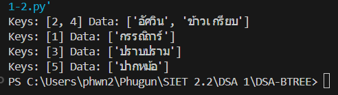
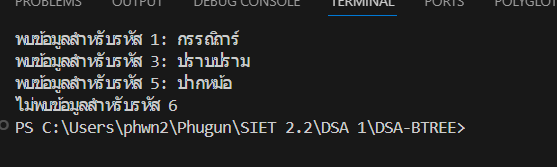
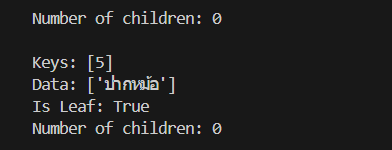

# ใบงานการทดลอง: B-Tree

## วัตถุประสงค์
1. เพื่อให้นักศึกษาเข้าใจโครงสร้างและหลักการทำงานของ B-Tree
2. เพื่อให้นักศึกษาสามารถสร้างและจัดการ B-Tree ที่มี Order ต่างๆ ได้
3. เพื่อให้นักศึกษาสามารถประยุกต์ใช้ B-Tree ในการจัดเก็บและค้นหาข้อมูลได้
4. เพื่อให้นักศึกษาเข้าใจการทำงานของ splitting และ merging ใน B-Tree

## อุปกรณ์ที่ใช้
1. เครื่องคอมพิวเตอร์
2. โปรแกรม IDE หรือ Text Editor ที่รองรับการเขียนโปรแกรมภาษา Python
3. ใบงานการทดลอง

## ทฤษฎีที่เกี่ยวข้อง

### B-Tree คืออะไร
B-Tree เป็นโครงสร้างข้อมูลแบบต้นไม้ที่ถูกออกแบบมาเพื่อการจัดเก็บข้อมูลในหน่วยความจำสำรอง โดยสามารถเก็บข้อมูล (data) คู่กับค่าคีย์ (key) ในแต่ละโหนดได้ ทำให้สามารถค้นหาและเข้าถึงข้อมูลได้อย่างมีประสิทธิภาพ

### Order ใน B-Tree
Order (m) คือค่าที่กำหนดขนาดของโหนดใน B-Tree โดยมีผลต่อคุณสมบัติต่างๆ ดังนี้:

1. จำนวนคู่ key-data ในแต่ละโหนด:
   - จำนวนสูงสุด: m-1 คู่
   - จำนวนต่ำสุด: ⌈m/2⌉-1 คู่ (ยกเว้น root)
   
2. จำนวนลูกในแต่ละโหนด:
   - จำนวนลูกสูงสุด: m ลูก
   - จำนวนลูกต่ำสุด: ⌈m/2⌉ ลูก (ยกเว้น root)

ตัวอย่าง: B-Tree order 3
- แต่ละโหนดมี key ได้มากที่สุด 2 ตัว (3-1)
- แต่ละโหนดมี key ขั้นต่ำ 1 ตัว (⌈3/2⌉-1)
- แต่ละโหนดมีลูกได้มากที่สุด 3 โหนด
- แต่ละโหนดต้องมีลูกอย่างน้อย 2 โหนด (⌈3/2⌉)

### การจัดเก็บข้อมูลใน B-Tree
1. ลักษณะการเก็บข้อมูล:
   - B-Tree สามารถเก็บข้อมูล (data) ไว้กับ key ได้ในทุกโหนด
   - แต่ละ key จะมี data field ที่เก็บข้อมูลหรือ pointer ไปยังข้อมูลจริง
   - การค้นหาข้อมูลสามารถพบได้ตั้งแต่ root node

2. เปรียบเทียบกับ B+ Tree:
   
   B-Tree:
   - เก็บข้อมูลได้ในทุกโหนด
   - ค้นหาข้อมูลเจอได้เร็วกว่าถ้าข้อมูลอยู่ในโหนดบน
   - ใช้พื้นที่น้อยกว่าในการเก็บข้อมูล
   - เหมาะกับการค้นหาข้อมูลแบบ random access

   B+ Tree:
   - เก็บข้อมูลเฉพาะที่ leaf nodes
   - โหนดภายในเก็บเฉพาะ key สำหรับนำทาง
   - มี linked list เชื่อมระหว่าง leaf nodes
   - เหมาะกับการค้นหาแบบ range query

### ผลของ Order ต่อประสิทธิภาพ
1. Order น้อย (เช่น 3, 4):
   - ข้อดี: ใช้หน่วยความจำน้อย, การเพิ่ม/ลบข้อมูลทำได้เร็ว
   - ข้อเสีย: ต้นไม้อาจสูง, การค้นหาอาจช้า

2. Order มาก (เช่น 100, 200):
   - ข้อดี: ต้นไม้เตี้ย, การค้นหาเร็ว
   - ข้อเสีย: ใช้หน่วยความจำมาก, การเพิ่ม/ลบข้อมูลอาจช้า

### การนำ B-Tree ไปใช้งานจริง
1. ระบบจัดการฐานข้อมูล (Database Management Systems)
   - MySQL ใช้ B-Tree และ B+Tree ในการสร้าง Index
   - PostgreSQL ใช้ B-Tree สำหรับ Primary Key และ Index
   - Oracle Database ใช้ B-Tree ในการจัดการ Index

2. ระบบจัดการคลังสินค้า (Inventory Management Systems)
   - จัดการรหัสสินค้า (SKU) และตำแหน่งจัดเก็บ
   - ติดตามสต็อกสินค้าแบบ real-time
   - ระบบค้นหาสินค้าที่ใกล้หมดอายุ

3. ระบบทะเบียนนักศึกษา (Student Registration Systems)
   - จัดการรหัสนักศึกษาและประวัติการเรียน
   - ระบบลงทะเบียนเรียน
   - ระบบตรวจสอบผลการเรียน

4. ระบบไฟล์ (File Systems)
   - NTFS ของ Windows
   - HFS+ ของ Mac OS X
   - Ext4 ของ Linux

5. ระบบ DNS (Domain Name System)
   - จัดเก็บและค้นหา domain name
   - ระบบ cache สำหรับ DNS resolver

### คุณสมบัติทั่วไปของ B-Tree
- เป็น Self-balancing tree (ปรับสมดุลตัวเองอัตโนมัติ)
- ทุกใบ (leaf) อยู่ในระดับเดียวกัน
- จำนวนลูกของแต่ละโหนดจะมากกว่าจำนวน key เสมอ 1 ตัว
- ข้อมูลใน key จะเรียงจากน้อยไปมากจากซ้ายไปขวา
- ลูกทางซ้ายของ key จะมีค่าน้อยกว่า key
- ลูกทางขวาของ key จะมีค่ามากกว่า key
- สามารถเก็บข้อมูลได้ในทุกโหนด ไม่จำกัดเฉพาะ leaf nodes

## การทดลอง

### การทดลองที่ 1: การสร้าง B-Tree Node และ B-Tree

```python
class BTreeNode:
    def __init__(self, leaf=True):
        # leaf: บอกว่าโหนดนี้เป็นใบหรือไม่
        self.leaf = leaf
        # keys: เก็บค่า key ในโหนด เรียงจากน้อยไปมาก
        self.keys = []
        # data: เก็บข้อมูลที่สัมพันธ์กับแต่ละ key
        self.data = []
        # children: เก็บ pointer ไปยังลูกของโหนด
        self.children = []

class BTree:
    def __init__(self, order):
        # root: pointer ไปยังโหนด root
        self.root = None
        # order: กำหนดจำนวน key สูงสุดในแต่ละโหนด
        self.order = order
        
    def get_min_keys(self):
        # คำนวณจำนวน key ขั้นต่ำที่แต่ละโหนดต้องมี
        return (self.order // 2) - 1 if self.order % 2 == 0 else self.order // 2
        
    def get_max_keys(self):
        # คำนวณจำนวน key สูงสุดที่แต่ละโหนดสามารถมีได้
        return self.order - 1
```

### การทดลองที่ 2: การเพิ่มข้อมูลใน B-Tree

```python
def insert(self, key, data):
    # ถ้ายังไม่มี root
    if self.root is None:
        self.root = BTreeNode()
        self.root.keys.append(key)
        self.root.data.append(data)
        return
        
    # ถ้า root เต็ม
    if len(self.root.keys) == self.get_max_keys():
        new_root = BTreeNode(leaf=False)
        new_root.children.append(self.root)
        self._split_child(new_root, 0)
        self.root = new_root
        
    self._insert_non_full(self.root, key, data)

def _insert_non_full(self, node, key, data):
    i = len(node.keys) - 1
    
    if node.leaf:
        # หาตำแหน่งที่จะแทรก key และ data
        while i >= 0 and key < node.keys[i]:
            i -= 1
        i += 1
        node.keys.insert(i, key)
        node.data.insert(i, data)
    else:
        # หา child ที่เหมาะสม
        while i >= 0 and key < node.keys[i]:
            i -= 1
        i += 1
        
        if len(node.children[i].keys) == self.get_max_keys():
            self._split_child(node, i)
            if key > node.keys[i]:
                i += 1
                
        self._insert_non_full(node.children[i], key, data)

def _split_child(self, parent, i):
    order = self.order
    child = parent.children[i]
    
    # สร้างโหนดใหม่
    new_node = BTreeNode(child.leaf)
    
    # คำนวณตำแหน่งกลาง (แก้ไขจากเดิม)
    mid = (order - 1) // 2
    
    # ย้าย keys และ data ไปยังโหนดใหม่
    new_node.keys = child.keys[mid+1:]  # แก้ไขจากเดิม
    new_node.data = child.data[mid+1:]  # แก้ไขจากเดิม
    
    # เก็บค่า key และ data ตรงกลางไว้
    mid_key = child.keys[mid]
    mid_data = child.data[mid]
    
    # ตัด keys และ data ของโหนดเดิม
    child.keys = child.keys[:mid]
    child.data = child.data[:mid]
    
    # ถ้าไม่ใช่ใบ ต้องย้ายลูกด้วย
    if not child.leaf:
        new_node.children = child.children[mid+1:]  # แก้ไขจากเดิม
        child.children = child.children[:mid+1]     # แก้ไขจากเดิม
    
    # เพิ่ม key และ data ตรงกลางไปยัง parent
    parent.keys.insert(i, mid_key)
    parent.data.insert(i, mid_data)
    parent.children.insert(i + 1, new_node)
```
### ผลการทดลองที่ 2
1. เขียนโปรแกรมเพื่อเพิ่มข้อมูลนักศึกษา 5 คน รันโปรแกรมและบันทึกรูปผลการรันโปรแกรม
   ```python
   from bintrees import BinaryTree

    class Student:
    def __init__(self, student_id, name, age, major):
        self.student_id = student_id
        self.name = name
        self.age = age
        self.major = major

    def __str__(self):
        return f"ID: {self.student_id}, Name: {self.name}, Age: {self.age}, Major: {self.major}"

    # สร้าง B-tree
    student_tree = BinaryTree()

    # เพิ่มข้อมูลนักศึกษา 5 คน
    students = [
    Student(1001, "Alice", 20, "Computer Science"),
    Student(1002, "Bob", 21, "Mathematics"),
    Student(1003, "Charlie", 22, "Physics"),
    Student(1004, "David", 19, "Engineering"),
    Student(1005, "Eve", 23, "Biology")
    ]

    for student in students:
    student_tree.insert(student.student_id, student)

    # แสดงผลข้อมูลทั้งหมด
    for key, value in student_tree.items():
    print(value)
   ```
   

2. แก้ไข class B-Tree ให้มีการเก็บจำนวน Entry สูงสุด และต่ำสุด แทนการใช้ get_min_keys และ get_max_keys
   ```python
   from bintrees import BinaryTree
    class Student:
    def __init__(self, student_id, name, age, major):
        self.student_id = student_id
        self.name = name
        self.age = age
        self.major = major

    def __str__(self):
        return f"ID: {self.student_id}, Name: {self.name}, Age: {self.age}, Major: {self.major}"

    class BTree:
    def __init__(self, min_entries, max_entries):
        self.min_entries = min_entries
        self.max_entries = max_entries
        self.tree = BinaryTree()

    def insert(self, key, value):
        if len(self.tree) < self.max_entries:
            self.tree.insert(key, value)
        else:
            print("B-Tree is full, cannot insert more entries.")

    def delete(self, key):
        if key in self.tree:
            self.tree.remove(key)
            if len(self.tree) < self.min_entries:
                print("Warning: B-Tree has fewer entries than the minimum required.")
        else:
            print("Key not found.")

    def display(self):
        for key, value in self.tree.items():
            print(value)

    # สร้าง B-Tree โดยกำหนด min_entries และ max_entries
    btree = BTree(min_entries=2, max_entries=5)

    # เพิ่มข้อมูลนักศึกษา 5 คน
    students = [
    Student(1001, "Alice", 20, "Computer Science"),
    Student(1002, "Bob", 21, "Mathematics"),
    Student(1003, "Charlie", 22, "Physics"),
    Student(1004, "David", 19, "Engineering"),
    Student(1005, "Eve", 23, "Biology")
    ]

    for student in students:
    btree.insert(student.student_id, student)

    # แสดงผลข้อมูลทั้งหมด
    btree.display()

 ```


### การทดลองที่ 3: การค้นหาข้อมูลใน B-Tree

```python
def search(self, key):
    """ค้นหาข้อมูลจาก key ที่กำหนด"""
    def _search_node(node, key):
        i = 0
        # หาตำแหน่งที่เหมาะสม
        while i < len(node.keys) and key > node.keys[i]:
            i += 1
            
        # ถ้าเจอ key ที่ตรงกัน
        if i < len(node.keys) and key == node.keys[i]:
            return (node, i)
            
        # ถ้าเป็นใบและไม่เจอ key
        if node.leaf:
            return None
            
        # ค้นหาในลูกที่เหมาะสม
        return _search_node(node.children[i], key)
    
    if self.root is None:
        return None
        
    result = _search_node(self.root, key)
    if result:
        node, index = result
        return node.data[index]
    return None
```
### ผลการทดลอง
1. เขียนโปรแกรมเพื่อทดสอบการค้นหาข้อมูลใน B-Tree ตามข้อมูลที่ได้เพิ่มในการทดลองก่อนหน้า
   ```python
   from bintrees import BinaryTree

    class Student:
    def __init__(self, student_id, name, age, major):
        self.student_id = student_id
        self.name = name
        self.age = age
        self.major = major

    def __str__(self):
        return f"ID: {self.student_id}, Name: {self.name}, Age: {self.age}, Major: {self.major}"

    class BTree:
    def __init__(self, min_entries, max_entries):
        self.min_entries = min_entries
        self.max_entries = max_entries
        self.tree = BinaryTree()

    def insert(self, key, value):
        if len(self.tree) < self.max_entries:
            self.tree.insert(key, value)
        else:
            print("B-Tree is full, cannot insert more entries.")

    def delete(self, key):
        if key in self.tree:
            self.tree.remove(key)
            if len(self.tree) < self.min_entries:
                print("Warning: B-Tree has fewer entries than the minimum required.")
        else:
            print("Key not found.")

    def search(self, key):
        if key in self.tree:
            return self.tree[key]
        return None

    def display(self):
        for key, value in self.tree.items():
            print(value)

    # สร้าง B-Tree โดยกำหนด min_entries และ max_entries
    btree = BTree(min_entries=2, max_entries=5)

    # เพิ่มข้อมูลนักศึกษา 5 คน
    students = [
    Student(1001, "Alice", 20, "Computer Science"),
    Student(1002, "Bob", 21, "Mathematics"),
    Student(1003, "Charlie", 22, "Physics"),
    Student(1004, "David", 19, "Engineering"),
    Student(1005, "Eve", 23, "Biology")
    ]

    for student in students:
    btree.insert(student.student_id, student)

    # แสดงผลข้อมูลทั้งหมด
    btree.display()

    # ทดสอบการค้นหา
    search_key = 1003
    found_student = btree.search(search_key)
    if found_student:
    print(f"Found: {found_student}")
    else:
    print(f"Student with ID {search_key} not found.")
    ```
   

### การทดลองที่ 4: การแสดงผล B-Tree

```python
def display(self):
    def _display(node, level):
        if node:
            # แสดง key และ data ในโหนดปัจจุบัน
            print('  ' * level + f"Keys: {node.keys}")
            print('  ' * level + f"Data: {node.data}")
            print('  ' * level + f"Is Leaf: {node.leaf}")
            print('  ' * level + f"Number of children: {len(node.children)}")
            print()
            # แสดงลูกทุกตัวแบบ recursive
            for child in node.children:
                _display(child, level + 1)
    
    print("B-Tree Structure:")
    _display(self.root, 0)
```
### ผลการทดลอง
1. เขียนโปรแกรมเพื่อทดสอบการแสดงข้อมูลใน B-Tree 
   ```python
   class BTreeNode:
    def __init__(self, t, leaf=False):
        self.t = t  # ค่าขั้นต่ำของกุญแจ (ขั้นต่ำ t-1 และสูงสุด 2t-1)
        self.leaf = leaf  # เป็นใบไม้หรือไม่
        self.keys = []  # รายการกุญแจ
        self.children = []  # รายการลูก

    def traverse(self):
        i = 0
        while i < len(self.keys):
            if not self.leaf:
                self.children[i].traverse()
            print(self.keys[i], end=' ')
            i += 1
        if not self.leaf:
            self.children[i].traverse()

    def split_child(self, i, y):
        t = self.t
        z = BTreeNode(t, y.leaf)
        self.children.insert(i + 1, z)
        self.keys.insert(i, y.keys[t - 1])
        z.keys = y.keys[t:(2*t - 1)]
        y.keys = y.keys[:t - 1]
        if not y.leaf:
            z.children = y.children[t:(2*t)]
            y.children = y.children[:t]

    class BTree:
    def __init__(self, t):
        self.root = BTreeNode(t, True)
        self.t = t

    def traverse(self):
        if self.root:
            self.root.traverse()
        print()

    def insert(self, k):
        root = self.root
        if len(root.keys) == (2 * self.t) - 1:
            new_root = BTreeNode(self.t, False)
            new_root.children.append(self.root)
            new_root.split_child(0, root)
            self.root = new_root
        self._insert_non_full(self.root, k)

    def _insert_non_full(self, node, k):
        if node.leaf:
            node.keys.append(k)
            node.keys.sort()
        else:
            i = len(node.keys) - 1
            while i >= 0 and k < node.keys[i]:
                i -= 1
            i += 1
            if len(node.children[i].keys) == (2 * self.t) - 1:
                node.split_child(i, node.children[i])
                if k > node.keys[i]:
                    i += 1
            self._insert_non_full(node.children[i], k)

    # ทดสอบการใช้งาน
    b_tree = BTree(3)
    values = [10, 20, 5, 6, 12, 30, 7, 17]
    for v in values:
    b_tree.insert(v)

    print("B-Tree traversal after insertions:")
    b_tree.traverse()


   ```
   

### การทดลองที่ 5: ตัวอย่างการใช้งานจริง :ระบบทะเบียนนักศึกษา

```python
# สร้าง B-Tree สำหรับระบบทะเบียน
registration_system = BTree(order=3)

# เพิ่มข้อมูลนักศึกษา
def register_student(student_id, info):
    registration_system.insert(student_id, {
        "name": info["name"],
        "gpa": info["gpa"],
        "courses": info["courses"]
    })

# เพิ่มข้อมูลตัวอย่าง
register_student(6301, {
    "name": "สมชาย ใจดี",
    "gpa": 3.75,
    "courses": ["CS101", "CS102"]
})

register_student(6302, {
    "name": "สมหญิง รักเรียน",
    "gpa": 3.85,
    "courses": ["CS101", "MATH101"]
})

# ค้นหาข้อมูลนักศึกษา
def get_student_info(student_id):
    student = registration_system.search(student_id)
    if student:
        print(f"รหัสนักศึกษา: {student_id}")
        print(f"ชื่อ: {student['name']}")
        print(f"เกรดเฉลี่ย: {student['gpa']}")
        print(f"วิชาที่ลงทะเบียน: {', '.join(student['courses'])}")
    else:
        print(f"ไม่พบข้อมูลนักศึกษารหัส {student_id}")

# ทดสอบค้นหา
get_student_info(6301)
```

## แบบฝึกหัด
1. ให้นักศึกษาเพิ่มเมธอดสำหรับลบข้อมูล (key และ data) ออกจาก B-Tree
class BTreeNode:
    def __init__(self, t, leaf=False):
        self.t = t  # ค่าขั้นต่ำของกุญแจ (ขั้นต่ำ t-1 และสูงสุด 2t-1)
        self.leaf = leaf  # เป็นใบไม้หรือไม่
        self.keys = []  # รายการกุญแจ
        self.children = []  # รายการลูก

    def traverse(self):
        i = 0
        while i < len(self.keys):
            if not self.leaf:
                self.children[i].traverse()
            print(self.keys[i], end=' ')
            i += 1
        if not self.leaf:
            self.children[i].traverse()

    def split_child(self, i, y):
        t = self.t
        z = BTreeNode(t, y.leaf)
        self.children.insert(i + 1, z)
        self.keys.insert(i, y.keys[t - 1])
        z.keys = y.keys[t:(2*t - 1)]
        y.keys = y.keys[:t - 1]
        if not y.leaf:
            z.children = y.children[t:(2*t)]
            y.children = y.children[:t]

    def remove(self, k):
        if k in self.keys:
            self.keys.remove(k)
        elif not self.leaf:
            for i in range(len(self.keys)):
                if k < self.keys[i]:
                    self.children[i].remove(k)
                    return
            self.children[-1].remove(k)

class BTree:
    def __init__(self, t):
        self.root = BTreeNode(t, True)
        self.t = t

    def traverse(self):
        if self.root:
            self.root.traverse()
        print()

    def insert(self, k):
        root = self.root
        if len(root.keys) == (2 * self.t) - 1:
            new_root = BTreeNode(self.t, False)
            new_root.children.append(self.root)
            new_root.split_child(0, root)
            self.root = new_root
        self._insert_non_full(self.root, k)

    def _insert_non_full(self, node, k):
        if node.leaf:
            node.keys.append(k)
            node.keys.sort()
        else:
            i = len(node.keys) - 1
            while i >= 0 and k < node.keys[i]:
                i -= 1
            i += 1
            if len(node.children[i].keys) == (2 * self.t) - 1:
                node.split_child(i, node.children[i])
                if k > node.keys[i]:
                    i += 1
            self._insert_non_full(node.children[i], k)
    
    def remove(self, k):
        if self.root:
            self.root.remove(k)
            if len(self.root.keys) == 0:
                if not self.root.leaf:
                    self.root = self.root.children[0]
                else:
                    self.root = None

    # ทดสอบการใช้งาน
    b_tree = BTree(3)
    values = [10, 20, 5, 6, 12, 30, 7, 17]
    for v in values:
    b_tree.insert(v)

    print("B-Tree traversal after insertions:")
    b_tree.traverse()

    # ทดสอบการลบ
    b_tree.remove(6)
    b_tree.remove(17)
    print("B-Tree traversal after deletions:")
    b_tree.traverse()

2. ให้นักศึกษาเพิ่มเมธอดสำหรับอัปเดตข้อมูล (data) สำหรับ key ที่กำหนด
class BTree:
    def __init__(self, t):
        self.root = BTreeNode(t, True)
        self.t = t

    def traverse(self):
        if self.root:
            self.root.traverse()
        print()

    def insert(self, k):
        root = self.root
        if len(root.keys) == (2 * self.t) - 1:
            new_root = BTreeNode(self.t, False)
            new_root.children.append(self.root)
            new_root.split_child(0, root)
            self.root = new_root
        self._insert_non_full(self.root, k)

    def _insert_non_full(self, node, k):
        if node.leaf:
            node.keys.append(k)
            node.keys.sort()
        else:
            i = len(node.keys) - 1
            while i >= 0 and k < node.keys[i]:
                i -= 1
            i += 1
            if len(node.children[i].keys) == (2 * self.t) - 1:
                node.split_child(i, node.children[i])
                if k > node.keys[i]:
                    i += 1
            self._insert_non_full(node.children[i], k)
    
    def remove(self, k):
        if self.root:
            self.root.remove(k)
            if len(self.root.keys) == 0:
                if not self.root.leaf:
                    self.root = self.root.children[0]
                else:
                    self.root = None

    def update(self, old_key, new_key):
        # ค้นหาและอัปเดตคีย์ที่มีอยู่ใน B-Tree
        if self.root:
            if self._update_in_node(self.root, old_key, new_key):
                print(f"Key {old_key} updated to {new_key}.")
            else:
                print(f"Key {old_key} not found.")
        else:
            print("The tree is empty.")

    def _update_in_node(self, node, old_key, new_key):
        # เช็คในโน้ดปัจจุบัน
        if old_key in node.keys:
            index = node.keys.index(old_key)
            node.keys[index] = new_key
            return True
        elif node.leaf:
            return False
        else:
            # ถ้าไม่พบในโน้ดปัจจุบัน จะไปหาต่อในลูกของโน้ด
            for i in range(len(node.keys)):
                if old_key < node.keys[i]:
                    return self._update_in_node(node.children[i], old_key, new_key)
            return self._update_in_node(node.children[-1], old_key, new_key)

3. ให้นักศึกษาเพิ่มเมธอดสำหรับแสดงข้อมูลทั้งหมดใน B-Tree เรียงตาม key
class BTreeNode:
    def __init__(self, t, leaf=False):
        self.t = t
        self.leaf = leaf
        self.keys = []
        self.children = []

    def traverse(self):
        # แสดงคีย์ในลำดับที่ถูกต้องจาก left ไปขวา
        i = 0
        while i < len(self.keys):
            if not self.leaf:
                self.children[i].traverse()
            print(self.keys[i], end=' ')
            i += 1
        if not self.leaf:
            self.children[i].traverse()

    def split_child(self, i, y):
        t = self.t
        z = BTreeNode(t, y.leaf)
        self.children.insert(i + 1, z)
        self.keys.insert(i, y.keys[t - 1])
        z.keys = y.keys[t:(2*t - 1)]
        y.keys = y.keys[:t - 1]
        if not y.leaf:
            z.children = y.children[t:(2*t)]
            y.children = y.children[:t]

    def remove(self, k):
        if k in self.keys:
            self.keys.remove(k)
        elif not self.leaf:
            for i in range(len(self.keys)):
                if k < self.keys[i]:
                    self.children[i].remove(k)
                    return
            self.children[-1].remove(k)

    def display_all_keys(self, result):
        # ทำการ traverse และเก็บข้อมูลคีย์ทั้งหมดไว้ใน result
        i = 0
        while i < len(self.keys):
            if not self.leaf:
                self.children[i].display_all_keys(result)
            result.append(self.keys[i])
            i += 1
        if not self.leaf:
            self.children[i].display_all_keys(result)

class BTree:
    def __init__(self, t):
        self.root = BTreeNode(t, True)
        self.t = t

    def traverse(self):
        if self.root:
            self.root.traverse()
        print()

    def insert(self, k):
        root = self.root
        if len(root.keys) == (2 * self.t) - 1:
            new_root = BTreeNode(self.t, False)
            new_root.children.append(self.root)
            new_root.split_child(0, root)
            self.root = new_root
        self._insert_non_full(self.root, k)

    def _insert_non_full(self, node, k):
        if node.leaf:
            node.keys.append(k)
            node.keys.sort()
        else:
            i = len(node.keys) - 1
            while i >= 0 and k < node.keys[i]:
                i -= 1
            i += 1
            if len(node.children[i].keys) == (2 * self.t) - 1:
                node.split_child(i, node.children[i])
                if k > node.keys[i]:
                    i += 1
            self._insert_non_full(node.children[i], k)

    def remove(self, k):
        if self.root:
            self.root.remove(k)
            if len(self.root.keys) == 0:
                if not self.root.leaf:
                    self.root = self.root.children[0]
                else:
                    self.root = None

    def update(self, old_key, new_key):
        if self.root:
            self.root.update(old_key, new_key)

    def display_all_keys(self):
        result = []
        if self.root:
            self.root.display_all_keys(result)
        return result

# ทดสอบการใช้งาน
b_tree = BTree(3)
values = [10, 20, 5, 6, 12, 30, 7, 17]
for v in values:
    b_tree.insert(v)

print("B-Tree traversal after insertions:")
b_tree.traverse()

# ทดสอบการแสดงข้อมูลทั้งหมด
all_keys = b_tree.display_all_keys()
print("All keys in B-Tree sorted:", all_keys)

4. ให้นักศึกษาเพิ่มเมธอดสำหรับค้นหาข้อมูลแบบช่วง (range search)
class BTreeNode:
    def __init__(self, t, leaf=False):
        self.t = t
        self.leaf = leaf
        self.keys = []
        self.children = []

    def traverse(self):
        i = 0
        while i < len(self.keys):
            if not self.leaf:
                self.children[i].traverse()
            print(self.keys[i], end=' ')
            i += 1
        if not self.leaf:
            self.children[i].traverse()

    def split_child(self, i, y):
        t = self.t
        z = BTreeNode(t, y.leaf)
        self.children.insert(i + 1, z)
        self.keys.insert(i, y.keys[t - 1])
        z.keys = y.keys[t:(2*t - 1)]
        y.keys = y.keys[:t - 1]
        if not y.leaf:
            z.children = y.children[t:(2*t)]
            y.children = y.children[:t]

    def remove(self, k):
        if k in self.keys:
            self.keys.remove(k)
        elif not self.leaf:
            for i in range(len(self.keys)):
                if k < self.keys[i]:
                    self.children[i].remove(k)
                    return
            self.children[-1].remove(k)

    def display_all_keys(self, result):
        i = 0
        while i < len(self.keys):
            if not self.leaf:
                self.children[i].display_all_keys(result)
            result.append(self.keys[i])
            i += 1
        if not self.leaf:
            self.children[i].display_all_keys(result)

    def range_search(self, low, high, result):
        # ค้นหาคีย์ในช่วง [low, high]
        i = 0
        while i < len(self.keys) and self.keys[i] < low:
            i += 1
        
        while i < len(self.keys) and self.keys[i] <= high:
            result.append(self.keys[i])
            i += 1

        if not self.leaf:
            while i < len(self.children):
                self.children[i].range_search(low, high, result)
                i += 1

class BTree:
    def __init__(self, t):
        self.root = BTreeNode(t, True)
        self.t = t

    def traverse(self):
        if self.root:
            self.root.traverse()
        print()

    def insert(self, k):
        root = self.root
        if len(root.keys) == (2 * self.t) - 1:
            new_root = BTreeNode(self.t, False)
            new_root.children.append(self.root)
            new_root.split_child(0, root)
            self.root = new_root
        self._insert_non_full(self.root, k)

    def _insert_non_full(self, node, k):
        if node.leaf:
            node.keys.append(k)
            node.keys.sort()
        else:
            i = len(node.keys) - 1
            while i >= 0 and k < node.keys[i]:
                i -= 1
            i += 1
            if len(node.children[i].keys) == (2 * self.t) - 1:
                node.split_child(i, node.children[i])
                if k > node.keys[i]:
                    i += 1
            self._insert_non_full(node.children[i], k)

    def remove(self, k):
        if self.root:
            self.root.remove(k)
            if len(self.root.keys) == 0:
                if not self.root.leaf:
                    self.root = self.root.children[0]
                else:
                    self.root = None

    def update(self, old_key, new_key):
        if self.root:
            self.root.update(old_key, new_key)

    def display_all_keys(self):
        result = []
        if self.root:
            self.root.display_all_keys(result)
        return result

    def range_search(self, low, high):
        result = []
        if self.root:
            self.root.range_search(low, high, result)
        return result

# ทดสอบการใช้งาน
b_tree = BTree(3)
values = [10, 20, 5, 6, 12, 30, 7, 17]
for v in values:
    b_tree.insert(v)

print("B-Tree traversal after insertions:")
b_tree.traverse()

# ทดสอบการค้นหาข้อมูลในช่วง [5, 17]
range_result = b_tree.range_search(5, 17)
print("Range search result [5, 17]:", range_result)

   
